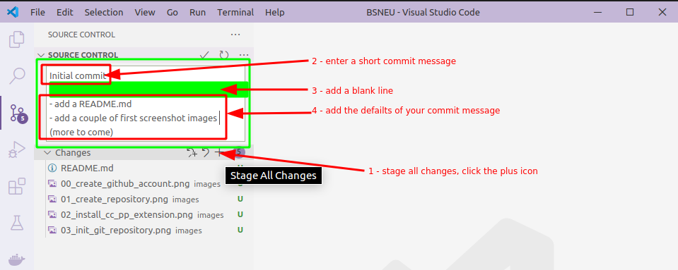
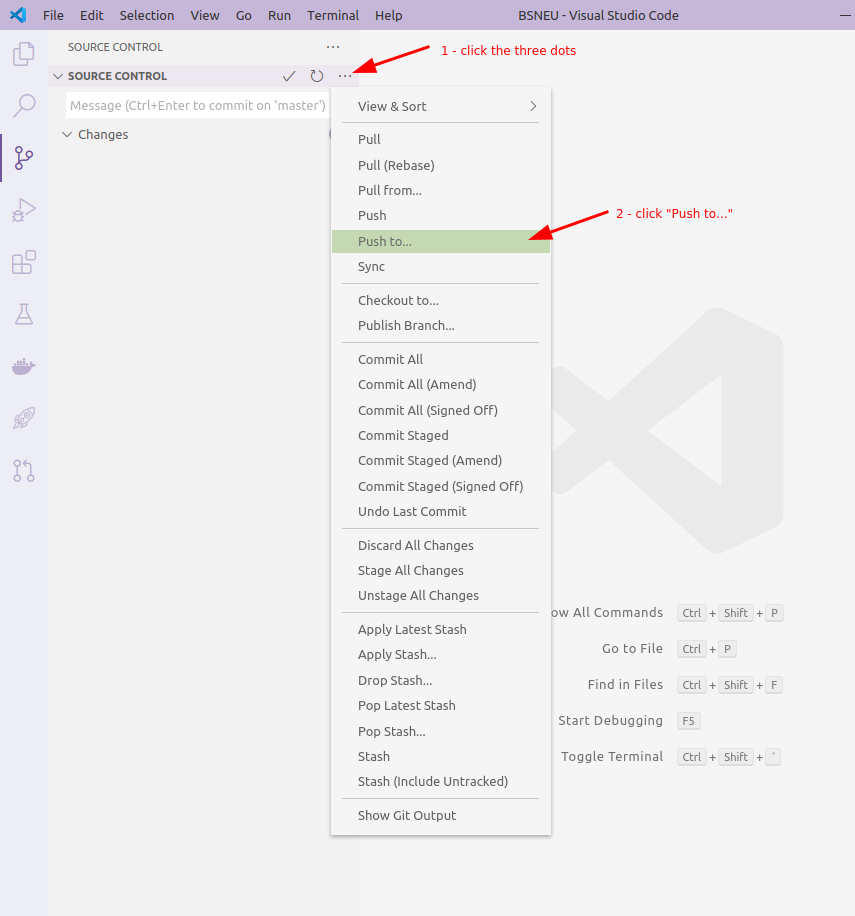

- [Course 00 - How to save your code with git and GitHub](#course-00---how-to-save-your-code-with-git-and-github)
  - [First Time Setup](#first-time-setup)
    - [1 - (Optional) Install VsCode & C/C++ Extension](#1---optional-install-vscode--cc-extension)
    - [2 - Create GitHub Account](#2---create-github-account)
    - [3 - (Optional) Create GitHub private repository](#3---optional-create-github-private-repository)
    - [4 - Create local directory](#4---create-local-directory)
    - [5 - (Optional) Open with VsCode](#5---optional-open-with-vscode)
    - [6 - Open in terminal and setup git credentials](#6---open-in-terminal-and-setup-git-credentials)
    - [7 - (Optional) Init git repository](#7---optional-init-git-repository)
    - [8 - (Optional) Add remote](#8---optional-add-remote)
    - [9 - (GUI Alternative) Publish to GitHub](#9---gui-alternative-publish-to-github)
  - [Repetive steps](#repetive-steps)
    - [git add](#git-add)
    - [git commit](#git-commit)
    - [git push](#git-push)
    - [(GUI Alternative) With the VsCode source control UI](#gui-alternative-with-the-vscode-source-control-ui)
- [Course 01 - Learning Linux basics](#course-01---learning-linux-basics)
  - [Learning Linux bash basics](#learning-linux-bash-basics)
    - [mkdir](#mkdir)
    - [cd](#cd)
    - [pwd](#pwd)
    - [cp](#cp)
    - [ls](#ls)
    - [more & tail](#more--tail)
    - [mv](#mv)
    - [rm](#rm)
    - [cat](#cat)
  - [Create a simple C program that returns its arguments](#create-a-simple-c-program-that-returns-its-arguments)
  - [compile](#compile)
  - [run](#run)
- [Course 02 - System calls for process management](#course-02---system-calls-for-process-management)
  - [Level 1 - simple shell](#level-1---simple-shell)
  - [Level 2 - multiple child processes](#level-2---multiple-child-processes)
- [Course 03 - communication via sockets](#course-03---communication-via-sockets)
  - [Part 1 - Server](#part-1---server)
  - [Part 2 - Client](#part-2---client)
  - [(Optional) Part 3 - Bonus](#optional-part-3---bonus)
- [Course 04 - system calls for file management](#course-04---system-calls-for-file-management)

# Course 00 - How to save your code with git and GitHub

To save your code in this internship we recommend to use git and a git server such as GitHub. However you can save your code as you wish.

**Please make sure you have either a [virtual machine](https://www.virtualbox.org/wiki/Downloads) or your host running with [Ubuntu Desktop](https://ubuntu.com/download/desktop)!**

Tutorials:

- [How to create an Ubuntu USB stick on Windows](https://ubuntu.com/tutorials/create-a-usb-stick-on-windows#1-overview)
- [How to create an Ubuntu USB stick on MacOS](https://ubuntu.com/tutorials/create-a-usb-stick-on-macos#1-overview)
- [How to install Ubuntu](https://ubuntu.com/tutorials/install-ubuntu-desktop#1-overview)

## First Time Setup

### 1 - (Optional) Install VsCode & C/C++ Extension

If you do not wish to use the text editors `vi` or `nano` inside the terminal, you can chose to install vscode, which brings features like synthax highlighting, intellisense autocomplete and more for editing C-Files. To do so, run the following command in Ubuntu:

```bash
sudo snap install code --classic
```

Or click here:

<iframe src="https://snapcraft.io/code/embedded?button=black" frameborder="0" width="100%" height="310px" style="border: 1px solid #CCC; border-radius: 2px;"></iframe>

Start vscode and install the C/C++ extension from Microsoft:


### 2 - Create GitHub Account


### 3 - (Optional) Create GitHub private repository

If you plan to use only the command line to perform git commands, use this step to create a repository in your GitHub space. If you plan to use the source control panel from within vscode, skip this step:


### 4 - Create local directory


### 5 - (Optional) Open with VsCode


### 6 - Open in terminal and setup git credentials


*Alternatively, if you do not want to use VsCode for this, you can press **CTRL + SHIFT + T** to open a new terminal in Ubuntu.*

Enter your GitHub git username and email into the terminal with
```bash
git config --global user.name YOUR_USERNAME
git config --global user.email YOUR_USER_EMAIL
```

so everytime you make a git commit, your username and email will be written into this commit.

### 7 - (Optional) Init git repository

Initialize your new local git repository with __EITHER__ using the git init command:
```bash
git init
```

__OR__ by using the VsCode source control section form the left panel.

**Attention**: Skip this step if you want to use the GitHub integration to publish a new repository (Step 9).


### 8 - (Optional) Add remote

Connect your GitHub repository to your local git repository with:
```bash
git remote add origin https://github.com/YOUR_GITHUB_ACCOUNT_NAME/YOUR_GITHUB_REPOSITORY_NAME.git
```
Skip this step if you plan to use the VsCode UI for this.

### 9 - (GUI Alternative) Publish to GitHub

If you skipped steps 2, 7 and 8 you can now click the "Publish to GitHub" button, to create a private repository on GitHub, add the GitHub repository as a remote to your local repository and publish your local repository for the first time - all in one click. You will be asked to authorize VsCode to be connected to GitHub, so you do not need to enter your GitHub credentials every time you push a commit:


## Repetive steps

Everytime you want to "upload" changes to your GitHub git repository, you need to follow these steps.

### git add

Before you can bundle changes into a git commit you need to add files to your staging area, from which the commit is created.

With this command you add a file to the git staging area
```
git add NAME_OF_YOUR_FILE
```

or add all files you've changed to your staging area
```
git add *
```

### git commit

Now you can finalize a git commit (think of a bundled package of changes). Enter the following command to create a git commit with your staged files and a commit message:
```
git commit
```

### git push

Now your local repository has new changes bundled as (a) commit(s). To update your remote repository on GitHub you need to use the push command.
You can either just use
```
git push
```
to "upload" the current branch you are in (if you did not change, it should be named "master") to the origin remote, or decide which branch to push to which remote:

```
git push REMOTE_NAME BRANCH_NAME
```

### (GUI Alternative) With the VsCode source control UI

Alternatively, you can use VsCode (or any other git client) to stage, commit, switch branch, pull, push, fetch or to use any other git command.





# Course 01 - Learning Linux basics

*Dislaimer*: even if we talk about Linux here, most if not all commands should also work on other unix systems such as MacOs, however it has only been tested on Linux.

## Learning Linux bash basics

For all of the following commands you need a command line interface such as GNOME terminal in Ubuntu (CTRL + ALT + T) or the built-in terminal in vscode.

Information about how to use the commands can be gained with calling the terminal program ```man```. 

For example:

```bash
man cd
```

```man``` should be your primary source of information about a terminal program in the following internships. It comes preinstalled with most Linux distributions and does not need any internet connection.

### mkdir

With ```mkdir``` you can create/make directories in Linux/Unix.

Create the directory ```test```:

```bash
mkdir test
```

### cd

With ```cd``` you can **c**hange the **d**irectory. Change to your newly created directory:

```bash
cd test
```

### pwd

With ```pwd``` you can **p**rint the current **w**orking **d**irectory to your terminal:

```bash
pwd
```

### cp

With ```cp``` you can **c**o**p**y files and directories (```-r```).
Copy the file ```passwd``` (which was used by the program ```passwd```) into your current working directory:

```bash
cp /etc/passwd .
cp passwd passwdcopy01
cp passwd passwdcopy02
```
### ls

With ```ls``` you can print a list of files and (sub)directories in a given directory.

Use:

```bash
ls
ls -lt
ls -l passwdcopy01
ls -l p*
```

### more & tail

With ```more``` and ```tail``` you can print the content of files, view the manual for further information and differences:

```bash
man more
man tail
more passwdcopy02
more *
tail passwdcopy01
```

### mv

With ```mv``` you can **m**o**v**e or rename files and directories.
Rename your passwdcopy01 to passwdcopy01_renamed with:

```bash
mv passwdcopy01 passwdcopy01_renamed
```

### rm

**r**e**m**ove your renamed copy01 of passwd with:

```bash
rm passwdcopy01_renamed
```

### cat

Create a file and write into it from within the terminal, when you are done quit with **CTRL + D**:

```bash
cat > my_new_file
my name is Hans # quit with CTRL + C
```

## Create a simple C program that returns its arguments

Use either terminal editors like ```vi``` or ```nano``` or a more comfortable solution like vscode & C/C++ extension to create a C program ```my_arg.c``` that returns the arguments that you've entered.

## compile

Compile your created C program with the following shell command, where ```my_arg``` is the name of the *output file* (thus the argument ```-o```) which you can chose and ```my_arg.c``` is the C file you've previously created and the source of the compilation:

```bash
gcc -o my_arg my_arg.c
```

## run

To run your program in the terminal run it with a trailing ```./``` before its file name:

```bash
./my_arg
```

Add any strings you can chose to have arguments as your output:

```bash
./my_arg 2021 is the year of the linux desktop
```

# Course 02 - System calls for process management

## Level 1 - simple shell

Write a C-program ```my_shell.c``` that includes the following structure and test your program with the command ```date``` and with ```/bin/date```:

```C
...
while(1) {
  print_command_promt();
  read_and_save_command();

  if(fork() > 0) {
    /* parent process */
    wait(status);
  }
  else {
    /* child process */
    execve(command, ...);
  }
}
...
```

Tips:
- use the well known functions ```scanf()``` and ```printf()``` for I/O
- design your program to ignore arguments attached to ```./my_shell.c```
- print the return value and the value of the ```errno``` variable of each syscall (set ```errno``` to ```0``` before calling it)

## Level 2 - multiple child processes

Write a C-program ```my_fork.c```:
- create ten child processes with a break of one second between each fork()
- every child process should sleep() for 30 seconds and should terminate after
- after the parent process has created the child process, it should wait() for the termination of the son process

Tips:
- print out what is happening in your program with proper printf()'s at each step
- run your program ```my_fork.c``` in the background (```/my_fork.c &```) and show the processes with ```ps```

# Course 03 - communication via sockets

Create a client/server application to communicate via sockets.

## Part 1 - Server

Create the C program ```server.c``` that receives a port as an argument and runs the following system calls:
1. ```socket``` - create a socket
2. ```bind``` - bind the port you've given the server via the argument to the socket you've created
3. ```listen```: marks the socket as passive and ready for incoming connections
4. endless loop:
   1. ```accept``` - wait and accept a client request
   2. ```recv``` - process the client message
   3. ```send``` - send the string "SERVER" in return
   4. ```close``` - close the connection

## Part 2 - Client

Create the C program ```client.c``` that connects to the given name and port of the target system and runs the following system calls:
1. ```socket``` - creation of a socket
2. ```connect``` - connect to the server
3. ```send``` - send "CLIENT" to the server
4. ```recv``` - receive and print the response
5. ```close``` - close the connection

## (Optional) Part 3 - Bonus

- The server provides the following services:
  - add - addition of two integers
  - sub - subtraction of two integers
  - div - division of two integers
  - mul - multiplication of two integers
- Create a struct ```message``` in ```message.h``` to define the structure of the provided services
- expand the client:
  - after the connection is set, read a math task in the form of ```7 + 5``` with ```scanf()```
  - package the task into a ```message``` and send it to the server
  - after the client has received the answer from the server the server message will be "unziped" and printed to the terminal
- expand the server
  - the client math task will be extracted from the client message
  - the task will be calculated
  - the result will be put into an answer message


# Course 04 - system calls for file management

General must-haves for your programs:

1. Implement an argument check at the start of your programs - if the amount of arguments or the arguments are wrong the programs should terminate with a ```printf()``` tip for the correct arguments
2. You must check the return values of the sys calls
3. If an error occurs you must check the ```errno``` variable and ```printf()``` the corresponding error message

To-Do:

1. ```my_creat [filename] [text]```: creates a file with a given ```fileame``` and writes the given ```text``` into it 
2. ```my_open [filename]```: opens a file and prints the content
3. ```my_lseek [filename]```: opens a file, moves with ```lseek``` to end end of file, increases the file by 20 chars with ```lseek```, writes text at the end of the file and returns the content of the file with ```read```
4. ```my_stat [filename]```: prints the attributes of the file with ```fstat```. Tip: the ```time_t``` attributes can be converted into a date format with ```localtime```

Bonus:

5. ```my_chmod [filename] [mode]```: sets the mode of a file with ```fchmod```
6. ```my_access [filename]```: prints the permissions of a file
7. ```my_mkdir [dirname] [mode]```: creates a directory with a given name and permissions
8. ```my_read_dir [dirname]```: prints the contents of the given directory