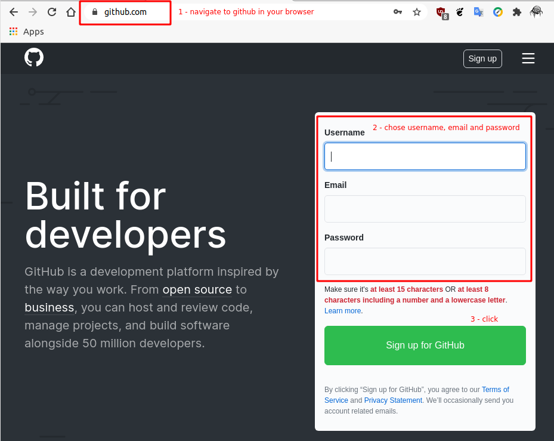
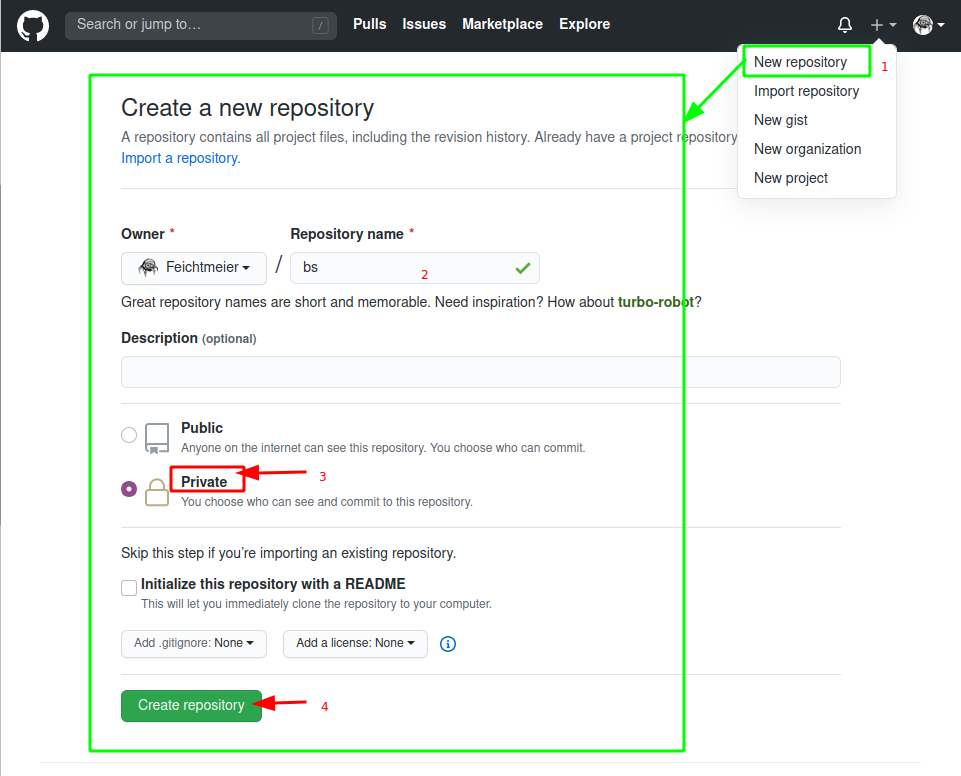
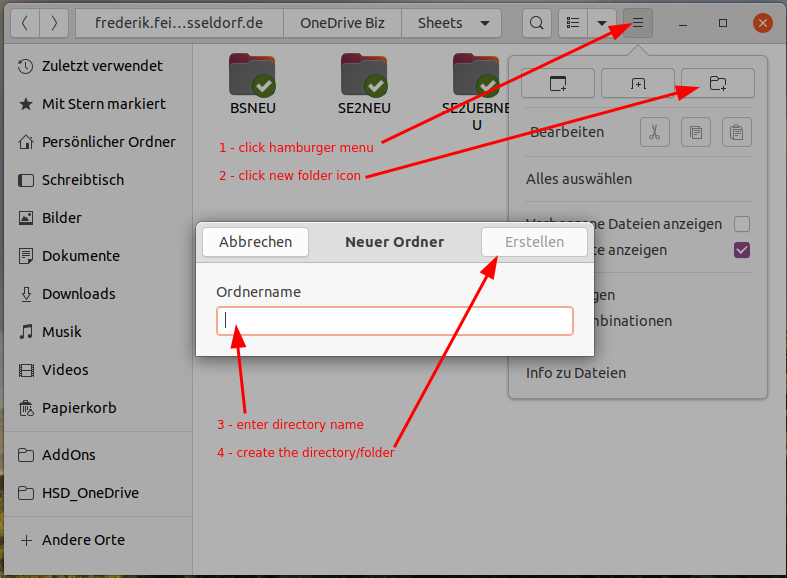
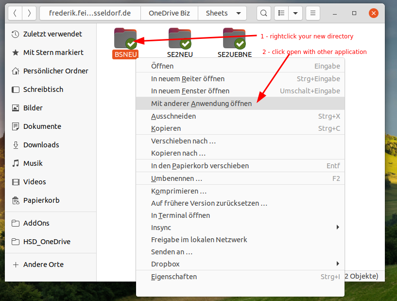
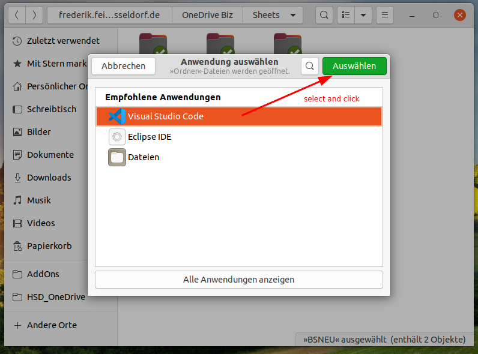
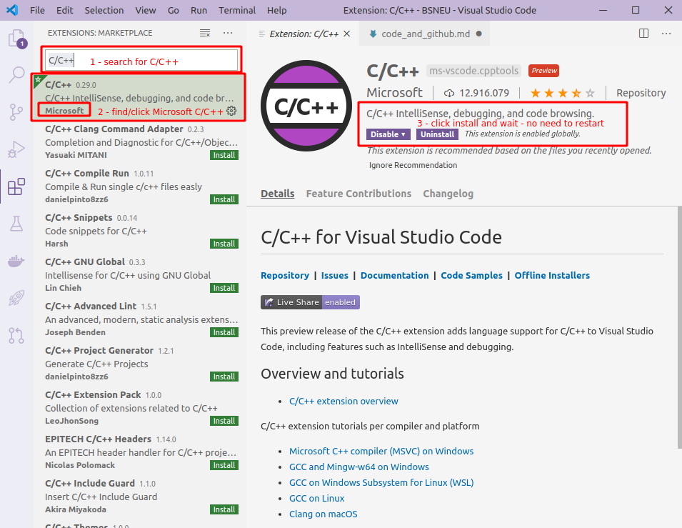
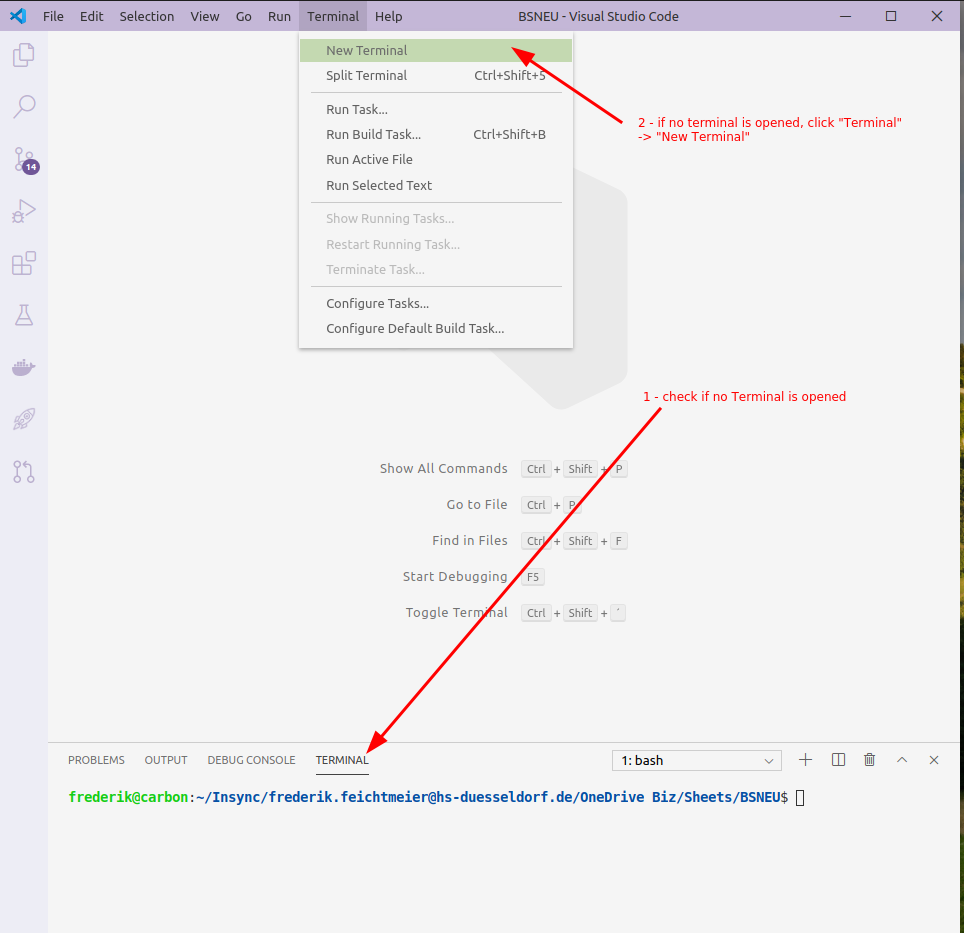
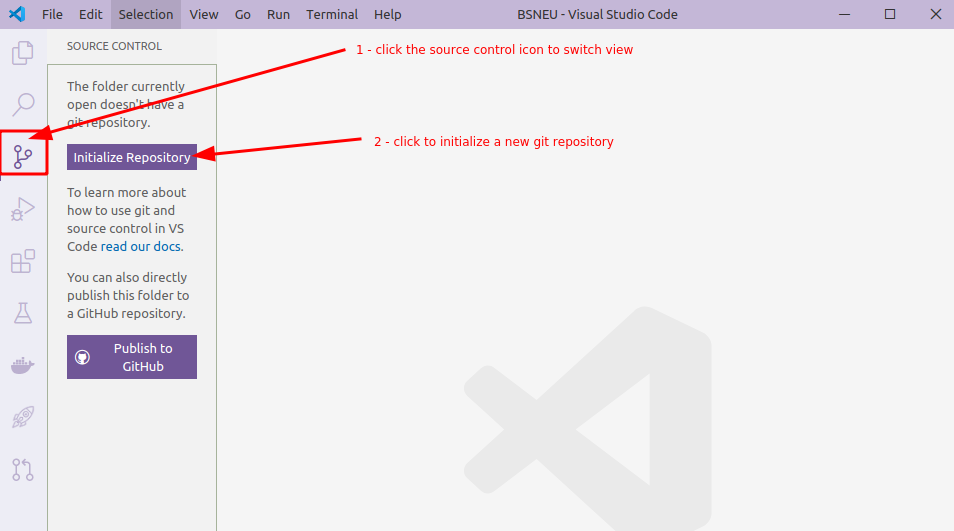
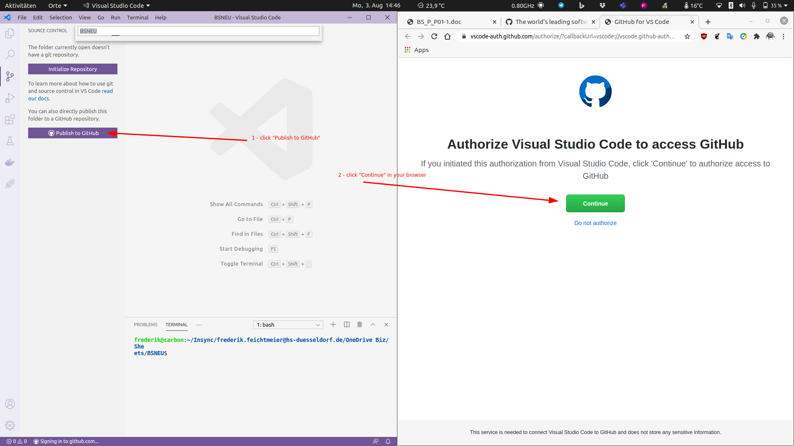
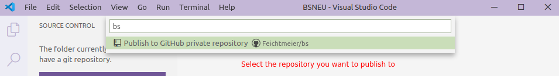

- [First Time Setup](#first-time-setup)
  - [1 - Create GitHub Account](#1---create-github-account)
  - [2 - (Optional) Create GitHub private repository](#2---optional-create-github-private-repository)
  - [3 - Create local directory](#3---create-local-directory)
  - [4 - Open with VsCode](#4---open-with-vscode)
  - [5 - Install Microsoft C/C++ Extension](#5---install-microsoft-cc-extension)
  - [6 - Open in terminal and setup git credentials](#6---open-in-terminal-and-setup-git-credentials)
  - [7 - (Optional) Init git repository](#7---optional-init-git-repository)
  - [8 - (Optional) Add remote](#8---optional-add-remote)
  - [9 - Publish to GitHub](#9---publish-to-github)
- [Repetive steps](#repetive-steps)
  - [git add](#git-add)
  - [git commit](#git-commit)
  - [git push](#git-push)

# First Time Setup

## 1 - Create GitHub Account



## 2 - (Optional) Create GitHub private repository

If you plan to use only the command line to perform git commands, use this step to create a repository in your GitHub space. If you plan to use the source control panel from within vscode, skip this step:



## 3 - Create local directory



## 4 - Open with VsCode





## 5 - Install Microsoft C/C++ Extension



## 6 - Open in terminal and setup git credentials



Enter your GitHub git username and email into the terminal with
```bash
git config --global user.name YOUR_USERNAME
git config --global user.email YOUR_USER_EMAIL
```

so everytime you make a git commit, your username and email will be written into this commit.

## 7 - (Optional) Init git repository

Initialize your new local git repository with __EITHER__ using the git init command:
```bash
git init
```

__OR__ by using the VsCode source control section form the left panel.

Attention: Skip this step if you want to use the GitHub integration to publish a new repository.



## 8 - (Optional) Add remote

Connect your GitHub repository to your local git repository with:
```bash
git remote add origin https://github.com/YOUR_GITHUB_ACCOUNT_NAME/YOUR_GITHUB_REPOSITORY_NAME.git
```
Skip this step if you plan to use the VsCode UI for this.

## 9 - Publish to GitHub





# Repetive steps

Everytime you want to "upload" changes to your GitHub git repository, you need to follow these steps.

## git add

Before you can bundle changes into a git commit you need to add files to your staging area, from which the commit is created.

With this command you add a file to the git staging area
```
git add NAME_OF_YOUR_FILE
```

or add all files you've changed to your staging area
```
git add *
```

## git commit

Now you can finalize a git commit (think of a bundled package of changes). Enter the following command to create a git commit with your staged files and a commit message:
```
git commit
```

## git push
